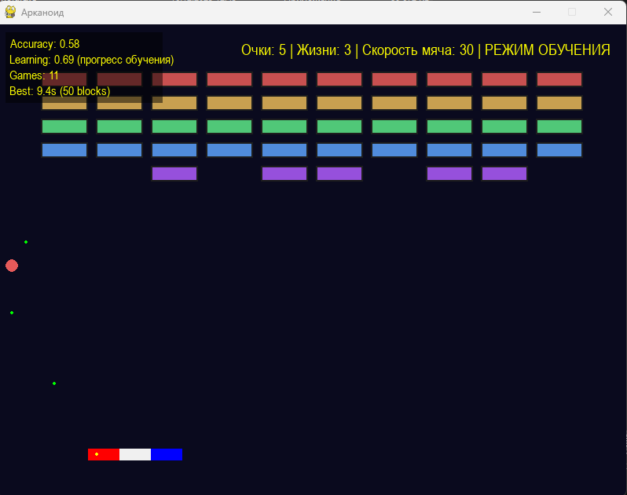

## 🎯 Ключевые особенности проекта

### 🏗️ Архитектурные подходы

- **Модульная архитектура с миксинами**: AIPlayer использует множественное наследование (25+ миксинов) для организации функциональности
- **Разделение ответственности**: Четкое разделение игровой логики (`game/`) и AI логики (`ai/`)
- **Dependency Injection**: Поддержка инъекции зависимостей для тестирования и гибкости
- **Централизованная конфигурация**: Все настройки вынесены в отдельные файлы (`config.py`, `game_config.py`)
- **Модульный игровой цикл**: Главный цикл разбит на специализированные модули (`game_loop_*.py`)

### 🤖 AI и машинное обучение

- **Предсказание траекторий**: Физически точное предсказание траектории мяча с учетом отскоков от стен и платформы
- **Система обучения**:
  - Кластеризация траекторий (KMeans)
  - Классификация успешности стратегий (RandomForest)
  - Сохранение и загрузка обученных моделей (`ai_model.json`)
  - Автоматическое использование накопленного опыта
- **Оптимизация позиции**: Поиск оптимального положения платформы для максимальной эффективности
- **Прицельное отбивание**:
  - Динамическая карта координат кубиков
  - Анализ видимых целей
  - Расчет оптимального угла отскока
  - Приоритизация целей по видимости траектории
  - Специальная логика для завершения уровня (≤10 кубиков)
- **Предотвращение зацикливания**:
  - Детекция повторяющихся паттернов (порог 80%)
  - Обнаружение позиционной стагнации
  - Анализ вертикальных траекторий
  - Автоматическая смена стратегий
- **Система стратегий**:
  - `center_focus` - фокус на центре
  - `edge_focus` - фокус на краях
  - `predictive_targeting` - предсказательное прицеливание

### ⚡ Оптимизации производительности

- **Асинхронное логирование**: Логирование в отдельном потоке через `QueueHandler` и `QueueListener` 
- **Асинхронное предсказание траекторий**: Многопоточные расчеты траекторий без блокировки основного потока
- **Кэширование**:
  - Кэш предсказаний траекторий
  - Эффективное управление памятью (`memory_efficient_cache.py`)
  - Оптимизация повторных вычислений
- **Dirty rectangles**: Обновление только измененных областей экрана
- **Ленивая загрузка**: Отложенная инициализация системы обучения (`LazyLearningSystem`)
- **Буферизованное логирование**: Оптимизация записи логов
- **Ротация логов**: Автоматическая ротация файлов логов для управления размером

### 📊 Мониторинг и аналитика

- **Performance Logger**: Логирование всех действий и результатов в JSON
- **Performance Monitor**: Мониторинг производительности AI в реальном времени
- **Метрики производительности**: Отслеживание времени выполнения, точности предсказаний, эффективности стратегий
- **Анализ результатов**: Скрипты для анализа потери мяча, деградации производительности
- **Статистика игр**: Сохранение всех результатов для анализа (`all_game_results.json`)

### 🎮 Режим работы

- **Training Mode (Режим обучения)**:
  - Активное обучение с адаптацией параметров
  - Адаптивная скорость платформы
  - Автоматический перезапуск после окончания игры
  - Расширенные метрики в HUD (Learning, Games, Best time)
  - Сохранение обученных моделей в `ai/models/ai_model.json`
  

### 🛡️ Системы предотвращения проблем

- **Предотвращение вертикальных ударов**: Случайные смещения при малом delta_x
- **Предотвращение отбитий в пустоту**: Максимум 2 последовательных отбития в пустоту
- **Принудительное прицеливание**: При малом количестве блоков (≤10) всегда точное прицеливание
- **Специальная логика отскоков от потолка**: Предотвращение симметричных вертикальных ударов
- **Переоценка после отбития**: Автоматическая переоценка ситуации после каждого отбития

### 🔧 Технические особенности

- **Типизация**: Полная поддержка type hints и проверка типов (mypy, pyright)
- **Кастомный JSON encoder**: Сериализация `Point` и `pygame.Rect` объектов
- **Кроссплатформенность**:
  - Определение frozen режима (exe) и корректные пути для разных платформ
  - Правильная работа с ресурсами через `sys._MEIPASS` в exe файлах
- **Централизованное логирование**: Единая конфигурация логирования для всего проекта

### 📚 Структура и организация

- **Модульность**:
- **Организация кода**:
  - Ядро системы (`core/`)
  - Стратегии (`strategy/`)
  - Прицеливание (`targeting/`)
  - Предсказания (`prediction/`)
  - Обучение (`learning/`)
  - Кэширование (`cache/`)
  - Анализ (`analysis/`)
- **Документация**: Подробная документация архитектуры, API, метрик и руководств

### 🎯 Математические модели

- **Предсказание траектории**:
  - Уравнения движения с учетом гравитации
  - Расчет отскоков от стен и платформы
  - Определение точек пересечения
- **Оптимизация позиции**:
  - Функция оценки с весами кубиков
  - Вероятность попадания в цели
  - Учет физических принципов отражения
- **Кластеризация траекторий**: Группировка похожих траекторий для обучения

### 🔄 Работа с данными

- **Сохранение моделей**: Автоматическое сохранение обученных моделей в JSON
- **Загрузка моделей**: Автоматическая загрузка при инициализации
- **Совместное использование данных**: Результаты обучения из Training Mode автоматически используются в Авторежиме
- **История попаданий**: Отслеживание успешных ударов с паттернами попаданий
- **Анализ эффективности**: Оценка эффективности стратегий на основе исторических данных
- **Управление файлами в exe**:
  - Файлы настроек и рекордов сохраняются напрямую в директории exe файла
  - Ресурсы (музыка, изображения) встроены в exe и доступны через `sys._MEIPASS`
  - Отсутствие создания лишних каталогов при работе exe файла

### 🛠️ Утилиты и скрипты

- **Сброс обучения**: Скрипт для очистки данных обучения
- **Запуск с многопоточностью**: Скрипты для Windows и Linux
- **Сборка exe файла**: Автоматизированная сборка исполняемого файла через PyInstaller (`build_exe.bat`)

### 📦 Сборка и распространение

- **PyInstaller конфигурация**: Специализированный spec файл (`arkanoid.spec`) для сборки exe
- **Автоматическая сборка**: Скрипт `build_exe.bat` автоматически:
  - Проверяет и устанавливает PyInstaller
  - Очищает предыдущие сборки
  - Собирает exe файл со всеми зависимостями
  - Включает все ресурсы (музыка, изображения, настройки)
- **Оптимизация exe**:
  - Скрытие консоли (GUI режим)
  - Перенаправление stdout/stderr для предотвращения открытия консоли
  - Правильная работа с ресурсами через `sys._MEIPASS`
  - Сохранение файлов настроек и рекордов напрямую в директории exe (без создания лишних каталогов)
- **Размер exe**: ~80-150 МБ (все зависимости включены)
- **Распространение**: Один файл `Arkanoid.exe` содержит все необходимое для запуска игры
