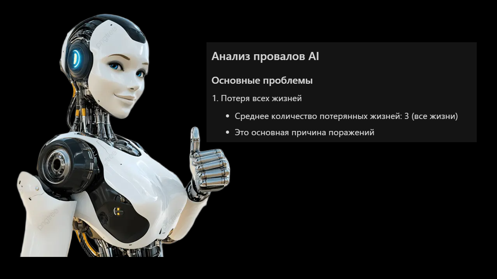

## Схема проекта

```
├── 📁 ai/                          # AI-система для авторежима
│   ├── ai_player.py                # Основной класс AIPlayer (координатор, 525 строк)
│   ├── ai_player_init.py           # Миксин: инициализация
│   ├── ai_player_state.py          # Миксин: управление состоянием
│   ├── ai_player_targeting.py      # Миксин: прицеливание
│   ├── ai_player_target_selection_part1.py # Миксин: выбор целей (часть 1)
│   ├── ai_player_target_selection_part2.py # Миксин: выбор целей (часть 2)
│   ├── ai_player_target_calculation.py # Миксин: расчет целей
│   ├── ai_player_positioning.py    # Миксин: позиционирование
│   ├── ai_player_position_optimization_part1.py # Миксин: оптимизация позиции (часть 1)
│   ├── ai_player_position_optimization_part2.py # Миксин: оптимизация позиции (часть 2)
│   ├── ai_player_movement.py       # Миксин: движение платформы
│   ├── ai_player_movement_core_part1.py # Миксин: ядро движения (часть 1)
│   ├── ai_player_movement_core_part2.py # Миксин: ядро движения (часть 2)
│   ├── ai_player_movement_core_part3.py # Миксин: ядро движения (часть 3)
│   ├── ai_player_movement_helpers.py # Миксин: вспомогательные функции движения
│   ├── ai_player_learning.py       # Миксин: обучение (координатор)
│   ├── ai_player_learning_core_part1.py # Миксин: ядро обучения (часть 1)
│   ├── ai_player_learning_core_part2.py # Миксин: ядро обучения (часть 2)
│   ├── ai_player_match_processing.py # Миксин: обработка матчей
│   ├── ai_player_metrics.py        # Миксин: метрики производительности
│   ├── ai_player_reset.py          # Миксин: сброс состояния
│   ├── ai_player_zones.py          # Миксин: работа с зонами
│   ├── ai_player_loop_prevention.py # Миксин: предотвращение зацикливания
│   ├── ai_player_ball_tracking.py # Миксин: отслеживание мяча
│   ├── ai_player_fallback.py      # Миксин: резервные стратегии
│   ├── ai_player_cache.py          # Миксин: кэширование
│   ├── ai_player_utils.py          # Миксин: утилиты
│   ├── ai_player_models.py         # Модели данных AIPlayer
│   ├── ai_player_debug_visualization.py # Миксин: визуализация отладки
│   ├── trajectory_predictor.py     # Предсказание траектории мяча
│   ├── async_trajectory_predictor.py # Асинхронное предсказание траекторий
│   ├── position_optimizer.py       # Оптимизация позиции платформы
│   ├── learning_system.py          # Система машинного обучения
│   ├── lazy_learning_system.py     # Ленивая система обучения
│   ├── performance_logger.py       # Логирование производительности
│   ├── performance_monitor.py      # Мониторинг производительности
│   ├── game_state.py               # Модель состояния игры
│   ├── config.py                    # Конфигурация AI
│   ├── exceptions.py               # Исключения AI системы
│   ├── logging_config.py           # Настройка логирования
│   ├── debug_logger.py             # Отладочное логирование
│   ├── platform_utils.py           # Утилиты для платформ
│   ├── buffered_logger.py          # Буферизованное логирование
│   ├── rotating_file_handler.py    # Ротирующий file handler
│   ├── async_logging_handler.py    # Асинхронное логирование
│   ├── analyze_ball_loss.py        # Анализ потери мяча
│   └── async_trajectory_example.py # Пример асинхронного предсказателя
│   │
│   ├── 📁 core/                    # Ядро AI системы
│   │   ├── ai_coordinator.py       # Координатор AI компонентов (395 строк)
│   │   ├── decision_maker.py       # Принятие решений (1349 строк)
│   │   └── movement_engine.py     # Движение платформы (1617 строк)
│   │
│   ├── 📁 strategy/                # Стратегии движения
│   │   ├── paddle_movement.py      # Стратегии движения платформы
│   │   ├── strategies.py           # Базовые стратегии
│   │   ├── target_tracker.py       # Отслеживание целей
│   │   └── zone_handler.py        # Обработка зон
│   │
│   ├── 📁 targeting/               # Система прицеливания
│   │   ├── target_selector.py      # Выбор целей
│   │   └── position_calculator.py  # Расчет позиций
│   │
│   ├── 📁 prediction/              # Предсказания
│   │   ├── trajectory_engine.py    # Движок траекторий (361 строка)
│   │   └── collision_detector.py   # Детектор столкновений (287 строк)
│   │
│   ├── 📁 learning/                # Обучение
│   │   ├── pattern_analyzer.py     # Анализ паттернов (237 строк)
│   │   └── strategy_optimizer.py   # Оптимизация стратегий (467 строк)
│   │
│   ├── 📁 cache/                   # Кэширование
│   │   └── memory_efficient_cache.py # Эффективный кэш
│   │
│   ├── 📁 models/                  # Обученные модели
│   │   └── ai_model.json           # Сохраненная модель
│   │
│   └── 📁 analysis/                # Анализ производительности
│       ├── all_game_results.json   # Результаты игр
│       └── analyze_performance_degradation.py # Анализ деградации
│
├── 📁 game/                        # Основная логика игры
│   ├── PyGameBall.py               # Главный файл игры (точка входа, 481 строка)
│   ├── game_loop_initialization.py # Инициализация игры (323 строки)
│   ├── game_loop_events.py         # Обработка событий (203 строки)
│   ├── game_loop_physics.py        # Физика и столкновения (1966 строк)
│   ├── game_loop_rendering.py      # Отрисовка игры (133 строки)
│   ├── game_loop_ai.py             # Логика AI (376 строк)
│   ├── game_config.py              # Конфигурация игры
│   ├── game_models.py              # Модели данных игры
│   ├── game_utils.py               # Утилиты игры
│   ├── game_ui.py                  # UI компоненты
│   ├── game_rendering.py           # Функции отрисовки
│   ├── game_main_helpers.py        # Вспомогательные функции (legacy)
│   ├── game_controllers.py        # Контроллеры игры
│   ├── game_views.py               # Представления игры
│   ├── highscores.py               # Система рекордов
│   ├── settings.py                 # Настройки игры
│   ├── di_container.py             # Dependency Injection контейнер
│   └── dirty_rects.py              # Оптимизация отрисовки
│
├── 📁 resources/                   # Ресурсы игры
│   ├── settings.json               # Настройки
│   ├── *.png, *.mp3                # Медиа файлы
│
├── 📁 docs/                        # Документация
│   ├── AI_ARCHITECTURE.md          # Архитектура AI
│   ├── AI_ARCHITECTURE_DIAGRAM.md  # Диаграммы архитектуры
│   ├── TRAJECTORY_CLUSTERING_AND_METRICS.md # Метрики траекторий
│   ├── PROJECT_STRUCTURE.md        # Этот файл
│   ├── STATISTICS_REPORT.md        # Статистика изменений проекта
│   ├── ANALYSIS_SUMMARY_V4.md      # Анализ производительности (v4)
│   ├── BALL_LOSS_ANALYSIS_V4.md    # Анализ потери мяча (v4)
│   ├── BALL_SPEED_ANALYSIS.md      # Анализ скорости мяча
│   ├── RESET_LEARNING_GUIDE.md     # Руководство по сбросу обучения
│   ├── LOGGING_FREEZE_ANALYSIS.md  # Анализ фризов из-за логирования
│   └── ASYNC_LOGGING_IMPLEMENTATION.md # Реализация асинхронного логирования
│
├── 📄 pyproject.toml               # Конфигурация Poetry
├── 📄 poetry.lock                  # Зафиксированные зависимости
├── 📄 install_dependencies.bat     # Установка зависимостей
├── 📁 utils/                       # Вспомогательные скрипты
│   ├── analyze_file_sizes.py      # Анализ размеров файлов
│   ├── cleanup_duplicate.py       # Очистка дубликатов
│   ├── remove_duplicate.py         # Удаление дубликатов
│   ├── reset_learning.py          # Сброс обучения
│   ├── run_with_multithreading.bat # Запуск с многопоточностью (Windows)
│   └── run_with_multithreading.sh  # Запуск с многопоточностью (Linux)
├── 📄 OPTIMIZATION_PLAN.md         # План оптимизации
├── 📄 PROGRESS_REPORT.md           # Отчет о прогрессе
├── 📄 REFACTORING_LOG.md           # Лог рефакторинга (часть 1)
├── 📄 REFACTORING_LOG_PART2.md     # Лог рефакторинга (часть 2)
├── 📄 REFACTORING_LOG_PART3_PYGAMEBALL.md # Лог рефакторинга PyGameBall
├── 📄 REMAINING_TASKS.md           # Оставшиеся задачи
├── 📄 PROJECT_IMPROVEMENT_PLAN.md  # План исправлений и доработок
├── 📄 MULTITHREADING_GUIDE.md      # Руководство по многопоточности
└── 📄 QUICK_START_MULTITHREADING.md # Быстрый старт многопоточности
```

## 🎯 Ключевые особенности проекта

### 🏗️ Архитектурные подходы

- **Модульная архитектура с миксинами**: AIPlayer использует множественное наследование (25+ миксинов) для организации функциональности
- **Разделение ответственности**: Четкое разделение игровой логики (`game/`) и AI логики (`ai/`)
- **Dependency Injection**: Поддержка инъекции зависимостей для тестирования и гибкости
- **Централизованная конфигурация**: Все настройки вынесены в отдельные файлы (`config.py`, `game_config.py`)
- **Модульный игровой цикл**: Главный цикл разбит на специализированные модули (`game_loop_*.py`)

### 🤖 AI и машинное обучение

- **Предсказание траекторий**: Физически точное предсказание траектории мяча с учетом отскоков от стен и платформы
- **Система обучения**: 
  - Кластеризация траекторий (KMeans)
  - Классификация успешности стратегий (RandomForest)
  - Сохранение и загрузка обученных моделей (`ai_model.json`)
  - Автоматическое использование накопленного опыта
- **Оптимизация позиции**: Поиск оптимального положения платформы для максимальной эффективности
- **Прицельное отбивание**: 
  - Динамическая карта координат кубиков
  - Анализ видимых целей
  - Расчет оптимального угла отскока
  - Приоритизация целей по видимости траектории
  - Специальная логика для завершения уровня (≤10 кубиков)
- **Предотвращение зацикливания**: 
  - Детекция повторяющихся паттернов (порог 80%)
  - Обнаружение позиционной стагнации
  - Анализ вертикальных траекторий
  - Автоматическая смена стратегий
- **Система стратегий**: 
  - `center_focus` - фокус на центре
  - `edge_focus` - фокус на краях
  - `predictive_targeting` - предсказательное прицеливание

### ⚡ Оптимизации производительности

- **Асинхронное логирование**: Логирование в отдельном потоке через `QueueHandler` и `QueueListener` (устранение фризов)
- **Асинхронное предсказание траекторий**: Многопоточные расчеты траекторий без блокировки основного потока
- **Кэширование**: 
  - Кэш предсказаний траекторий
  - Эффективное управление памятью (`memory_efficient_cache.py`)
  - Оптимизация повторных вычислений
- **Dirty rectangles**: Обновление только измененных областей экрана
- **Ленивая загрузка**: Отложенная инициализация системы обучения (`LazyLearningSystem`)
- **Буферизованное логирование**: Оптимизация записи логов
- **Ротация логов**: Автоматическая ротация файлов логов для управления размером

### 📊 Мониторинг и аналитика

- **Performance Logger**: Логирование всех действий и результатов в JSON
- **Performance Monitor**: Мониторинг производительности AI в реальном времени
- **Метрики производительности**: Отслеживание времени выполнения, точности предсказаний, эффективности стратегий
- **Анализ результатов**: Скрипты для анализа потери мяча, деградации производительности
- **Статистика игр**: Сохранение всех результатов для анализа (`all_game_results.json`)

### 🎮 Режим работы

- **Training Mode (Режим обучения)**: 
  - Активное обучение с адаптацией параметров
  - Динамическая скорость мяча (1-15)
  - Адаптивная скорость платформы (множитель 0.5-10.0)
  - Автоматический перезапуск после окончания игры
  - Расширенные метрики в HUD (Learning, Games, Best time)
  - Сохранение обученных моделей в `ai/models/ai_model.json`
  - Бесконечная продолжительность игры

### 🛡️ Системы предотвращения проблем

- **Предотвращение вертикальных ударов**: Случайные смещения при малом delta_x
- **Ограничение границ**: Запас 5 пикселей от краев экрана
- **Предотвращение отбитий в пустоту**: Максимум 2 последовательных отбития в пустоту
- **Принудительное прицеливание**: При малом количестве блоков (≤10) всегда точное прицеливание
- **Специальная логика отскоков от потолка**: Предотвращение симметричных вертикальных ударов
- **Переоценка после отбития**: Автоматическая переоценка ситуации после каждого отбития

### 🔧 Технические особенности

- **Типизация**: Полная поддержка type hints и проверка типов (mypy, pyright)
- **Обработка ошибок**: Специализированные исключения (`InvalidStateError`, `PredictionError`, `LearningError`, `DataError`)
- **Кастомный JSON encoder**: Сериализация `Point` и `pygame.Rect` объектов
- **Кроссплатформенность**: Определение frozen режима (exe) и корректные пути для разных платформ
- **Централизованное логирование**: Единая конфигурация логирования для всего проекта
- **Визуализация отладки**: Отображение предсказанных траекторий и оптимальных позиций (в debug режиме)

### 📚 Структура и организация

- **Модульность**: 
  
- **Организация кода**: 
  - Ядро системы (`core/`)
  - Стратегии (`strategy/`)
  - Прицеливание (`targeting/`)
  - Предсказания (`prediction/`)
  - Обучение (`learning/`)
  - Кэширование (`cache/`)
  - Анализ (`analysis/`)
- **Документация**: Подробная документация архитектуры, API, метрик и руководств

### 🎯 Математические модели

- **Предсказание траектории**: 
  - Уравнения движения с учетом гравитации
  - Расчет отскоков от стен и платформы
  - Определение точек пересечения
- **Оптимизация позиции**: 
  - Функция оценки с весами кубиков
  - Вероятность попадания в цели
  - Учет физических принципов отражения
- **Кластеризация траекторий**: Группировка похожих траекторий для обучения

### 🔄 Работа с данными

- **Сохранение моделей**: Автоматическое сохранение обученных моделей в JSON
- **Загрузка моделей**: Автоматическая загрузка при инициализации
- **Совместное использование данных**: Результаты обучения из Training Mode автоматически используются в Авторежиме
- **История попаданий**: Отслеживание успешных ударов с паттернами попаданий
- **Анализ эффективности**: Оценка эффективности стратегий на основе исторических данных

### 🛠️ Утилиты и скрипты

- **Сброс обучения**: Скрипт для очистки данных обучения
- **Анализ размеров файлов**: Утилита для мониторинга размеров модулей
- **Запуск с многопоточностью**: Скрипты для Windows и Linux
- **Очистка дубликатов**: Утилиты для поддержания чистоты кодовой базы